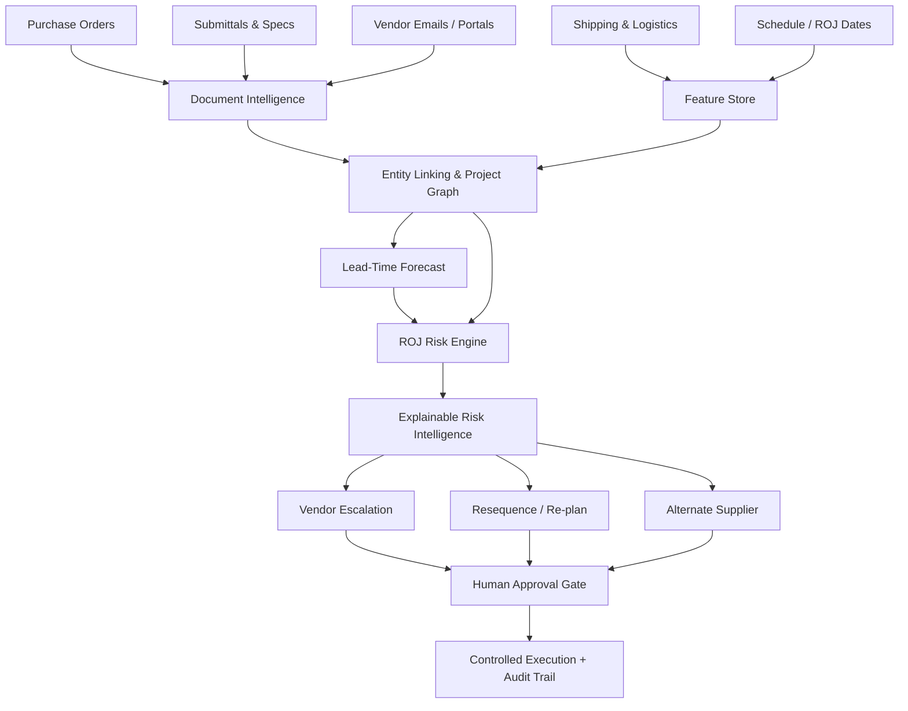

# ROJ Guard

> **Predict material delays before they become schedule delays.**

**ROJ Guard** is a predictive procurement intelligence and human-governed mitigation system for construction supply chains. It converts fragmented procurement signals—purchase orders, vendor communications, submittals, shipping updates, and Required-On-Job (ROJ) dates—into live material-risk intelligence, then prepares targeted mitigation actions before a delay reaches the site.

Built for the **Kaya AI IIT India Hackathon 2026 — Track 2: Supply Chain**.

---

## The Problem

Construction projects rarely fail because a team has *zero* information. They fail because the information is scattered.

A critical material may simultaneously exist as:

- a purchase order in one system,
- an approved submittal in another,
- a delayed fabrication update inside a vendor email,
- a shipment ETA in a logistics feed,
- and an ROJ date buried in the project schedule.

Traditional dashboards usually become useful **after** a milestone slips.

ROJ Guard is designed to answer a more valuable question:

> **Which material is likely to miss its Required-On-Job date, why, and what should the team do now?**

---

## What ROJ Guard Does

ROJ Guard turns raw supply-chain events into protective action through four connected layers:



### 1. Ingest
Accept structured and unstructured procurement signals:
- Purchase orders
- Submittals and specifications
- Vendor emails
- Shipping/logistics updates
- Schedule and ROJ dates

### 2. Understand
ROJ Guard extracts and links:
- Project
- Material
- Vendor
- Purchase order
- Shipment
- Schedule activity
- ROJ date
- Delay signals

### 3. Predict
The system combines historical delivery behavior with current project state to estimate:
- Predicted lead time
- Predicted arrival date
- Probability of missing ROJ
- Expected delay
- Low / Medium / High risk
- Critical-path exposure

### 4. Act
For risky materials, specialist agents prepare:
- Vendor escalation
- Schedule resequencing
- Alternate-supplier recommendations

**No outbound action executes without explicit human approval.**

---

## The Core Demo

ROJ Guard is designed around a simple, judge-visible proof:

```text
Healthy material
4% miss-ROJ risk
        │
        ▼
Vendor reports a 14-day production + dispatch delay
        │
        ▼
Signal is extracted and linked to the correct project entities
        │
        ▼
Features and forecast are recomputed
        │
        ▼
90% miss-ROJ risk
HIGH
        │
        ▼
ROJ Guard automatically prepares mitigation
        │
        ▼
Human reviews / edits / approves
        │
        ▼
Controlled execution + audit trail
```

This demonstrates the full Round-1 promise in one workflow:  
**signal → intelligence → prediction → mitigation → human approval → execution**.

---

## Product Experience

### Project Risk Overview
A portfolio-level view of:
- Active materials
- High/Medium/Low risk distribution
- Critical-path exposure
- Forecast-late materials
- Top risk drivers
- Materials requiring immediate attention

### Incoming Intelligence
Analyze a vendor email or uploaded project document directly inside the application.

The extraction flow is intentionally human-governed:

```text
Analyze
   ↓
Review extracted entities
   ↓
Confirm / edit
   ↓
Apply to Project
```

Nothing enters the project intelligence layer until the user confirms it.

### Real Data Lab
Bring a company procurement export directly into ROJ Guard without modifying the deterministic demo baseline.

The lab supports **CSV / XLSX / XLSM** with automatic schema mapping, human correction, data-quality validation and explicit model provenance. It now detects two distinct workflows rather than forcing every file into an ROJ schema.

**Project ROJ Mode** — when the upload contains Required-On-Job dates, ROJ Guard can score active materials immediately and can retrain the full lead-time + miss-ROJ model when sufficient historical outcomes exist.

**Historical Procurement Mode** — when an export has supplier/order/delivery history but no ROJ field, ROJ Guard does not fabricate an ROJ target. Instead it:
- cleans legitimate `Delivered` order-to-delivery outcomes,
- builds supplier completion, compliance, defect, savings and lead-time intelligence,
- trains an isolated XGBoost order-to-delivery model with a temporal holdout,
- compares model MAE against a naive historical baseline,
- asks the evaluator for a new PO date + real project ROJ date,
- converts the real lead-time forecast and forecast uncertainty into an explainable ROJ-risk scenario,
- compares the same scenario across suppliers while explicitly retaining a human capability-qualification gate.

The lab never overwrites `roj_guard.db` or the baseline model artifacts. Metrics shown for uploaded data are labeled as holdout/demo validation, not production claims.

### Material Intelligence
Drill into a single procurement line and inspect:
- Miss-ROJ probability
- Predicted arrival
- Required-On-Job date
- Forecast delay
- Vendor reliability
- Shipment state
- Critical-path status
- Latest vendor signal
- Explainable risk drivers

### Project Graph
Visualizes the project context around a material:

```text
Project
  └── Material
       ├── Vendor
       ├── Purchase Order
       ├── Shipment
       └── ROJ / Schedule
```

### Live Risk Reaction Demo
A deterministic scenario demonstrates a material moving from **Low** to **High** risk after a new vendor delay signal.

### Approval Center
Every agent-generated intervention is:
- reviewable,
- editable,
- approvable/rejectable,
- executable only after approval,
- retained in the action history.

---

## Why This Fits Kaya / Amber

ROJ Guard is not designed to replace Kaya's project intelligence foundation.

It is a **specialist predictive risk layer** that can sit on top of an existing project graph and add:

- material-level ROJ risk prediction,
- live supply-chain signal interpretation,
- explainable schedule-risk intelligence,
- human-governed mitigation workflows.

In a production integration, ROJ Guard can consume the project entities and procurement streams already unified by Kaya/Amber instead of rebuilding upstream integrations.

---

## AI + ML Architecture

| Capability | Prototype Implementation |
|---|---|
| Document intelligence | Gemini-based extraction with resilient local fallback |
| Entity matching | Structured IDs + fuzzy/entity linking |
| Historical feature engineering | Vendor reliability, lead-time history, delivery outcomes |
| Lead-time forecasting | XGBoost regressor |
| ROJ miss prediction | XGBoost classifier + operational rules |
| Risk explanation | Model/rule evidence surfaced in plain language |
| Agentic mitigation | Vendor escalation, resequencing, alternate supplier |
| Human-in-the-loop | Mandatory approval before execution |
| API layer | FastAPI |
| Product UI | Streamlit |
| Operational store | SQLite / SQLAlchemy |
| Graph layer | Neo4j-compatible project graph integration |

---

## Prototype Data & Evaluation

The hackathon prototype uses a synthetic but construction-realistic dataset with:

- **360 historical completed deliveries**
- **30 active procurement lines**
- multiple material categories
- multiple vendors
- balanced healthy / emerging / critical scenarios

The synthetic training pipeline is used to demonstrate end-to-end model behavior and product mechanics.

Example prototype validation produced approximately:
- **Lead-time MAE:** ~2.5 days
- **ROJ-risk AUC:** ~0.98

> These are **synthetic prototype validation metrics**, not production performance claims. Real deployment would require training and validation on representative historical project data.

---

## Reliability & Safety Design

ROJ Guard is intentionally designed to fail safely.

### AI extraction fallback
If the external LLM is unavailable, the prototype can fall back to a local deterministic parser for common delay-update patterns so the application does not collapse during a live demo.

### Low-confidence handling
Extracted information can be reviewed before it enters project intelligence.

### Human approval boundary
No escalation, schedule intervention, or alternate-supplier action executes autonomously.

### Auditability
Agent actions retain:
- risk state at creation,
- reasoning,
- draft content,
- approval status,
- reviewer,
- execution status,
- execution output.

---

## Repository Structure

```text
roj-guard-kaya-ai/
│
├── main_layer1.py                 # FastAPI application entry point
├── database_layer1.py             # Database configuration
├── models_layer1.py               # Ingestion/domain models
├── schemas_layer1.py              # Request/validation schemas
├── gemini_extractor_layer1.py     # AI document intelligence
│
├── models_layer2.py               # Graph/feature models
├── entity_linking_layer2.py       # Entity resolution
├── graph_builder_layer2.py        # Project graph construction
├── sync_service_layer2.py         # DB ↔ graph synchronization
├── feature_engineering_layer2.py  # Delivery/vendor features
├── feature_api_layer2.py          # Feature endpoints
│
├── models_layer3.py               # Risk model persistence schema
├── feature_engineering_layer3.py  # ML feature preparation
├── train_models_layer3.py         # XGBoost training
├── inference_layer3.py            # Live risk inference
├── api_layer3.py                  # Risk APIs
│
├── agents_layer4.py               # Mitigation agents
├── models_layer4.py               # Agent-action lifecycle
├── api_layer4.py                  # Approval/action APIs
├── execution_layer4.py            # Controlled execution
│
├── api_experience.py              # Product/demo experience APIs
├── real_data_lab.py                # CSV/XLSX mapping, validation, retraining & BYOD scoring
├── dashboard_layer3.py            # Streamlit product UI
├── seed_data_layer1.py            # Synthetic demo/training data
│
├── requirements.txt
├── Dockerfile
├── render.yaml
├── start.sh
└── .env.example
```

---

## Run Locally

### 1. Clone

```bash
git clone https://github.com/Dipanshur19/roj-guard-kaya-ai.git
cd roj-guard-kaya-ai
```

### 2. Create a Python 3.11 environment

**Windows**

```powershell
py -3.11 -m venv venv
.\venv\Scripts\Activate.ps1
```

**macOS / Linux**

```bash
python3.11 -m venv venv
source venv/bin/activate
```

### 3. Install dependencies

```bash
pip install -r requirements.txt
```

### 4. Configure environment

Copy `.env.example` to `.env` and configure your Gemini API key and optional graph settings.

Never commit `.env`.

### 5. Seed / rebuild the demonstration dataset

```bash
python seed_data_layer1.py
```

### 6. Start the backend

```bash
uvicorn main_layer1:app --host 127.0.0.1 --port 8000 --reload
```

FastAPI: `http://127.0.0.1:8000`  
Swagger: `http://127.0.0.1:8000/docs`

### 7. Start the UI

In another terminal:

```bash
streamlit run dashboard_layer3.py
```

Open: `http://localhost:8501`

---

## Recommended Demo Path

```text
1. Overview
      ↓
2. Incoming Intelligence
      ↓
3. Real Data Lab (optional BYOD proof)
      ↓
4. Apply a vendor-delay signal
      ↓
4. Observe Before → Signal → After
      ↓
5. Material Intelligence
      ↓
6. Live Demo
      ↓
7. Approve mitigation
      ↓
8. Approval Center / Audit Trail
      ↓
9. Project Graph
```

---

## Deployment

The repository includes deployment assets:

```text
Dockerfile
render.yaml
start.sh
```

The application can be deployed as a public web service with secrets supplied through the deployment platform's environment-variable settings.

**Live Prototype:**  
`ADD_DEPLOYED_URL_HERE`

**Video Demo:**  
`ADD_VIDEO_URL_HERE`

---

## Security

This repository intentionally excludes:
- API keys
- `.env`
- local virtual environments
- generated outbound demo files
- temporary uploaded documents

Do not commit secrets.

---

## Product Vision

ROJ Guard starts with material ROJ risk, but the same architecture can expand into a broader procurement control tower:

- portfolio-level vendor risk
- schedule-aware supplier selection
- fabrication milestone prediction
- automated expediting playbooks
- critical-path material prioritization
- cross-project supplier exposure
- procurement scenario simulation
- enterprise Amber/Kaya integration

The goal is not another dashboard.

The goal is a system that can **see schedule risk early enough to do something about it**.

---

## Team

**Team Reckless**  
Kaya AI IIT India Hackathon 2026  
Track 2 — Supply Chain

---

## Submission

**ROJ Guard — Predictive Material ROJ Risk & Human-Governed Mitigation Agent**

---

<p align="center">
  <b>From fragmented vendor signals to protected construction schedules.</b>
</p>
